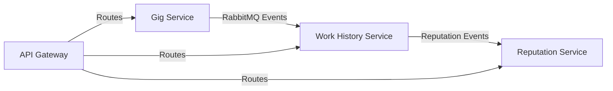

# Event Contract Alignment - Gig Service ↔ Work History Service

## 🎯 Overview

This document defines the aligned event contracts between the Gig Service and Work History Service to ensure accurate data synchronization for creator work history and reputation tracking.

## 📡 Event Flow Architecture



## 🔌 RabbitMQ Configuration

### Exchanges
- **`gig_events`** (topic): For gig-related events → Work History Service
- **`credit_events`** (direct): For credit/boost events → Credit Service
- **`reputation_events`** (topic): From Work History → Reputation Service

### Routing Keys
- `gig.completed` - Gig completion with full work data
- `gig.delivered` - Work delivery/submission events
- `gig.rated` - Rating updates (if separate from completion)

## 📋 Event Contracts

### 1. Gig Completion Event (`gig.completed`)

**Published by:** Gig Service  
**Consumed by:** Work History Service  
**Trigger:** When submission is reviewed and approved

```javascript
{
  "gigId": "gig_abc123",
  "userId": "user_xyz789",           // The freelancer/creator
  "clientId": "client_def456",       // The gig poster
  "gigData": {
    "title": "Website Development",
    "description": "Build a responsive website...",
    "category": "web-development",
    "skills": ["javascript", "react", "css"],
    "budgetRange": "500-1000",
    "roleRequired": "frontend-developer"
  },
  "completionData": {
    "completedAt": "2025-06-30T10:30:00Z",
    "rating": 5,                     // Client rating (1-5)
    "feedback": "Excellent work!",   // Client feedback
    "withinBudget": true,
    "actualAmount": 750
  },
  "deliveryData": {
    "onTime": true,                  // Met deadline
    "deliveryTime": 7,               // Days taken to complete
    "portfolioItems": []             // Future: attachments/links
  }
}
```

### 2. Work Delivery Event (`gig.delivered`)

**Published by:** Gig Service  
**Consumed by:** Work History Service  
**Trigger:** When freelancer submits work

```javascript
{
  "gigId": "gig_abc123",
  "userId": "user_xyz789",
  "clientId": "client_def456",
  "deliveryData": {
    "submissionTitle": "Final Website Files",
    "deliveredAt": "2025-06-30T09:15:00Z"
  }
}
```

### 3. Rating Update Event (`gig.rated`)

**Published by:** Gig Service  
**Consumed by:** Work History Service  
**Trigger:** When client updates rating (if separate from completion)

```javascript
{
  "gigId": "gig_abc123",
  "userId": "user_xyz789",
  "clientId": "client_def456",
  "rating": 4.5,
  "feedback": "Great work, minor revisions needed",
  "ratedAt": "2025-06-30T11:00:00Z"
}
```

## 🔄 Service Implementation

### Gig Service Changes

#### RabbitMQ Service Updates
```javascript
// New exchange for gig events
this.gigExchange = 'gig_events';

// Publish to specific exchange
async publishGigEvent(routingKey, eventData) {
    return this.publishEvent(routingKey, eventData, this.gigExchange);
}
```

#### Controller Updates
```javascript
// Enhanced event publishing with work history integration
handleWorkHistoryEvents = async (eventType, eventData, baseEvent) => {
    switch (eventType) {
        case 'submission_reviewed':
            if (eventData.gigCompleted) {
                // Fetch full gig data and publish complete work record
                await rabbitmqService.publishGigEvent('gig.completed', workHistoryEvent);
            }
            break;
        case 'work_submitted':
            // Publish delivery event
            await rabbitmqService.publishGigEvent('gig.delivered', deliveryEvent);
            break;
    }
};
```

### Work History Service Changes

#### Event Consumption
```javascript
// Bind to gig events exchange
await this.channel.bindQueue(workHistoryQueue, 'gig_events', 'gig.completed');
await this.channel.bindQueue(workHistoryQueue, 'gig_events', 'gig.delivered');
await this.channel.bindQueue(workHistoryQueue, 'gig_events', 'gig.rated');
```

#### Event Handlers
```javascript
async handleGigCompleted(event) {
    const workData = {
        userId: event.userId,
        gigId: event.gigId,
        clientId: event.clientId,
        title: event.gigData.title,
        description: event.gigData.description,
        category: event.gigData.category,
        skills: event.gigData.skills,
        completedAt: new Date(event.completionData.completedAt),
        clientRating: event.completionData.rating,
        clientFeedback: event.completionData.feedback,
        // ... other fields
    };
    
    await WorkHistoryService.recordCompletedWork(workData);
}
```

## 🌐 API Gateway Integration

### New Routes Added
```javascript
// Public routes (no auth required)
app.use('/api/portfolio', proxyMiddleware('workHistory'));
app.use('/api/achievements', proxyMiddleware('workHistory'));
app.use('/api/summary', proxyMiddleware('workHistory'));

// Protected routes (auth required)
app.use('/api/work-history', authMiddleware, proxyMiddleware('workHistory'));
```

### Service Configuration
```javascript
workHistory: {
    name: 'work-history-service',
    url: process.env.WORK_HISTORY_SERVICE_URL || 'http://localhost:4007',
    timeout: 30000,
    retries: 3,
    healthCheck: '/health'
}
```

## ✅ Verification Steps

### 1. Service Health Check
```bash
# Check all services are running
curl http://localhost:4004/health  # Gig Service
curl http://localhost:4007/health  # Work History Service
curl http://localhost:3000/health  # API Gateway
```

### 2. Event Flow Test
```bash
# Run integration test
node test-integration.js
```

### 3. Manual Workflow Test
1. Create a gig via Gig Service
2. Apply to the gig
3. Submit work
4. Review and approve submission
5. Check Work History Service for recorded work
6. Verify reputation score update

### 4. API Gateway Test
```bash
# Test public routes
curl http://localhost:3000/api/summary/platform-stats
curl http://localhost:3000/api/portfolio/user/test-user-123

# Test protected routes (requires auth)
curl -H "Authorization: Bearer <token>" http://localhost:3000/api/work-history/user/test-user-123
```

## 🎯 Data Flow Summary

1. **Gig Creation** → Gig Service stores gig data
2. **Work Submission** → Gig Service publishes `gig.delivered` event
3. **Submission Approval** → Gig Service publishes `gig.completed` event
4. **Work Recording** → Work History Service creates work record
5. **Reputation Update** → Work History Service notifies Reputation Service
6. **Achievement Check** → Work History Service evaluates and awards achievements

## 🔧 Troubleshooting

### Common Issues
1. **Exchange Not Found**: Ensure RabbitMQ exchanges are created on startup
2. **Event Not Consumed**: Check queue bindings and routing keys
3. **Data Missing**: Verify event payload structure matches contracts
4. **Service Unreachable**: Check service URLs in configuration

### Debug Commands
```bash
# Check RabbitMQ queues
rabbitmqctl list_queues

# Check exchanges
rabbitmqctl list_exchanges

# Monitor logs
tail -f services/gig-service/logs/combined.log
tail -f services/work-history-service/logs/combined.log
```

## 📈 Performance Considerations

- Events are published asynchronously to avoid blocking gig operations
- Work History Service uses caching (Redis) for frequently accessed data
- Database operations are optimized with proper indexing
- Failed events are retried with exponential backoff

## 🚀 Future Enhancements

1. **Portfolio Items**: Direct file upload integration for work deliverables
2. **Real-time Notifications**: WebSocket integration for live updates
3. **Advanced Analytics**: Time-series data for performance trends
4. **Blockchain Verification**: Immutable work history records

---

✅ **Status**: Event contracts are now aligned and services are properly coupled for accurate data synchronization!
